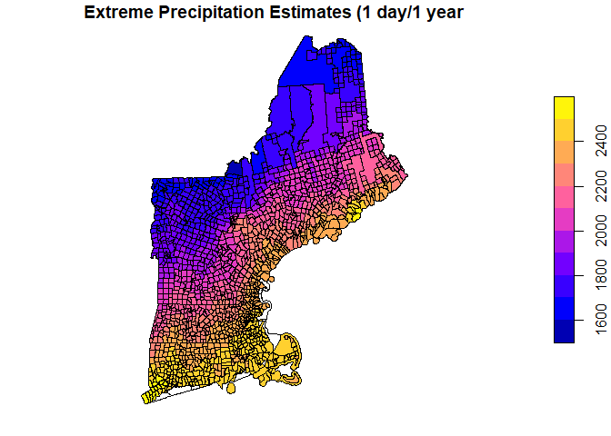
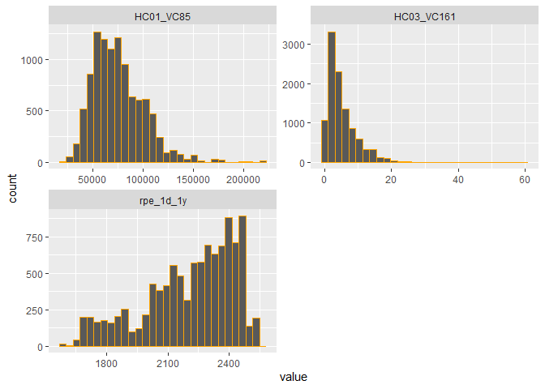
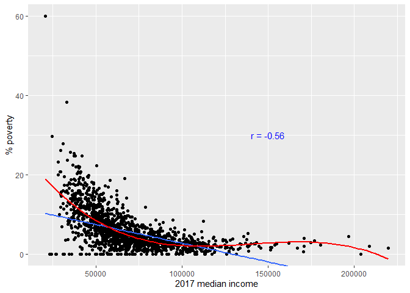
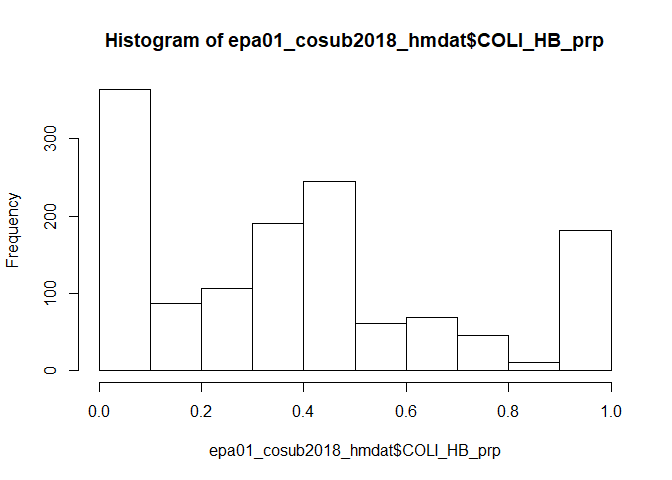
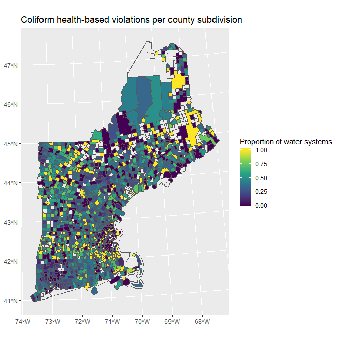

Spatial join of region 01 (New England) county subdivisions to
SDWIS/External data
================
2019-10-02

  - [Description](#description)
  - [Load packages](#load-packages)
  - [I. Load and join data](#i.-load-and-join-data)
      - [Load spatial boundary data](#load-spatial-boundary-data)
      - [Load locations data](#load-locations-data)
      - [Do spatial join](#do-spatial-join)
  - [II. Example modeling use](#ii.-example-modeling-use)
      - [Get SDWIS data](#get-sdwis-data)
      - [Generate dataset](#generate-dataset)
      - [Model 1](#model-1)
          - [Examine data](#examine-data)
          - [Apply logistic regression](#apply-logistic-regression)
      - [Heatmap](#heatmap)

## Description

Spatial join of water system locations (improved) for epa region 01 to
county subdivisions and associated data (US Census and environmental).

Data sources:

1.  external: [spatial boundaries: 2018 county
    subdivisions](https://www.census.gov/cgi-bin/geo/shapefiles/index.php?year=2018&layergroup=County+Subdivisions),
    also available
    [here](https://www.census.gov/geographies/mapping-files/time-series/geo/carto-boundary-file.html)
2.  external: SELECTED ECONOMIC CHARACTERISTICS 2013-2017 American
    Community Survey 5-Year Estimates: [2017 (latest year available at
    present)](https://factfinder.census.gov/faces/nav/jsf/pages/searchresults.xhtml?refresh=t)
3.  external: [spatial grid: extreme rainfall
    estimates](http://precip.eas.cornell.edu/)
4.  external: [improved pwsid location coordinates in Google
    Drive](https://drive.google.com/open?id=1oCcKON45B3mmqagA1U964Wl2xz3xwgFXwEMucnIz93w)
5.  SDWIS tables: water systems, violations

Coding outline:

1.  Load and spatially join pre-processed spatial data (county
    subdivisions and improved locations data).
      - Join this to SDWIS water systems table data as new table:
        `joined_df` of water systems with associated spatial data
2.  Example modeling use: exploratory logistic regression and heatmap
    using coliform violations data.

## Load packages

``` r
library(tidyr)
library(dplyr)
library(sf)
library(fs)
library(readr)
library(data.table)
library(lubridate)
library(jtools)
library(ggplot2)
library(car)
```

## I. Load and join data

### Load spatial boundary data

  - Geoprocessing can get pretty involved and files can be large, so
    working in another GitHub repo
    [spatial](https://github.com/jsecol/spatial) for the time being
      - loaded using <https://raw.githack.com/>
      - has US Census data attributes also pre-joined
          - HC01\_VC85: median income in 2017
          - HC03\_VC161: percent families/people w/past 12 mo. income
            below poverty level

<!-- end list -->

``` r
# reprojected to epsg: 26918

epa01_cosub2018 <- 
  st_read("https://raw.githack.com/jsecol/spatial/master/data/epa01_cosub2018.geojson", 
          stringsAsFactors = FALSE) %>% 
  st_transform(26918) %>% filter(TRUE)
```

    ## Reading layer `epa01_cosub2018' from data source `https://raw.githack.com/jsecol/spatial/master/data/epa01_cosub2018.geojson' using driver `GeoJSON'
    ## Simple feature collection with 1618 features and 21 fields
    ## geometry type:  MULTIPOLYGON
    ## dimension:      XY
    ## bbox:           xmin: -73.72777 ymin: 40.95094 xmax: -66.88544 ymax: 47.45985
    ## epsg (SRID):    4269
    ## proj4string:    +proj=longlat +ellps=GRS80 +towgs84=0,0,0,0,0,0,0 +no_defs

``` r
st_crs(epa01_cosub2018)
```

    ## Coordinate Reference System:
    ##   EPSG: 26918 
    ##   proj4string: "+proj=utm +zone=18 +ellps=GRS80 +towgs84=0,0,0,0,0,0,0 +units=m +no_defs"

  - Join extreme rainfall estimates also from spatial
repo

<!-- end list -->

``` r
raindata <- read_csv("https://raw.githack.com/jsecol/spatial/master/data/epa01_cosub2018_rain.csv")

epa01_cosub2018 <- epa01_cosub2018 %>% 
  left_join(., raindata[, c(1, 4)], by = "GEOID")
```

  - Example chloropleth map to view the boundaries

<!-- end list -->

``` r
plot(epa01_cosub2018["rpe_1d_1y"], 
     main = "Extreme Precipitation Estimates (1 day/1 year)")
```

<!-- -->

### Load locations data

  - also from spatial repo for time being
      - used Google Drive packages there

<!-- end list -->

``` r
epa01_watersystems <- 
  st_read("https://raw.githack.com/jsecol/spatial/master/data/epa01_watersystems.geojson", 
          stringsAsFactors = FALSE) %>% 
  st_transform(26918) %>% filter(TRUE)
```

    ## Reading layer `epa01_watersystems' from data source `https://raw.githack.com/jsecol/spatial/master/data/epa01_watersystems.geojson' using driver `GeoJSON'
    ## Simple feature collection with 10441 features and 7 fields
    ## geometry type:  POINT
    ## dimension:      XY
    ## bbox:           xmin: -73.64789 ymin: 41.01641 xmax: -67.00618 ymax: 47.34527
    ## epsg (SRID):    4326
    ## proj4string:    +proj=longlat +datum=WGS84 +no_defs

``` r
st_crs(epa01_cosub2018)
```

    ## Coordinate Reference System:
    ##   EPSG: 26918 
    ##   proj4string: "+proj=utm +zone=18 +ellps=GRS80 +towgs84=0,0,0,0,0,0,0 +units=m +no_defs"

### Do spatial join

``` r
joined_df <- epa01_watersystems %>% 
    st_join(., left = TRUE, epa01_cosub2018) %>% 
    st_drop_geometry()

sum(is.na(joined_df$INTPTLAT))
```

    ## [1] 0

``` r
head(joined_df) %>% print.data.frame()
```

    ##   PRIMACY_AGENCY_CODE EPA_REGION     PWSID PWS_TYPE_CODE SOURCE
    ## 1                  01         01 010106001           CWS   ECHO
    ## 2                  CT         01 CT0010111           CWS   ECHO
    ## 3                  CT         01 CT0012011           CWS   ECHO
    ## 4                  CT         01 CT0030011           CWS   ECHO
    ## 5                  CT         01 CT0030021           CWS   ECHO
    ## 6                  CT         01 CT0030031           CWS   ECHO
    ##          SOURCE_MATCH                      COMMENTS STATEFP COUNTYFP
    ## 1 010106001 CT0723011             Zip Code Centroid      09      011
    ## 2           CT0010111             Zip Code Centroid      09      013
    ## 3           CT0012011 ADDRESS MATCHING-HOUSE NUMBER      09      013
    ## 4           CT0030011             Zip Code Centroid      09      015
    ## 5           CT0030021 ADDRESS MATCHING-HOUSE NUMBER      09      015
    ## 6           CT0030031 ADDRESS MATCHING-HOUSE NUMBER      09      015
    ##   COUSUBFP COUSUBNS      GEOID    NAME     NAMELSAD LSAD CLASSFP MTFCC
    ## 1    42600 00213450 0901142600 Ledyard Ledyard town   43      T1 G4040
    ## 2    01080 00213382 0901301080 Andover Andover town   43      T1 G4040
    ## 3    01080 00213382 0901301080 Andover Andover town   43      T1 G4040
    ## 4    01430 00213384 0901501430 Ashford Ashford town   43      T1 G4040
    ## 5    01430 00213384 0901501430 Ashford Ashford town   43      T1 G4040
    ## 6    01430 00213384 0901501430 Ashford Ashford town   43      T1 G4040
    ##   CNECTAFP NECTAFP NCTADVFP FUNCSTAT     ALAND  AWATER    INTPTLAT
    ## 1     <NA>   76450     <NA>        A  98968753 4635709 +41.4311315
    ## 2      790   73450     <NA>        A  40012484  635900 +41.7329821
    ## 3      790   73450     <NA>        A  40012484  635900 +41.7329821
    ## 4      790   73450     <NA>        A 100392658 1832771 +41.8971227
    ## 5      790   73450     <NA>        A 100392658 1832771 +41.8971227
    ## 6      790   73450     <NA>        A 100392658 1832771 +41.8971227
    ##       INTPTLON              GEO.id HC03_VC161 HC01_VC85 rpe_1d_1y
    ## 1 -072.0203029 0600000US0901142600        4.2     88163  2.461558
    ## 2 -072.3746584 0600000US0901301080        0.0    100507  2.341707
    ## 3 -072.3746584 0600000US0901301080        0.0    100507  2.341707
    ## 4 -072.1714268 0600000US0901501430        9.6     68846  2.347619
    ## 5 -072.1714268 0600000US0901501430        9.6     68846  2.347619
    ## 6 -072.1714268 0600000US0901501430        9.6     68846  2.347619

  - good, although 1 in MA (09) put in NH (33)

<!-- end list -->

``` r
table(joined_df$PRIMACY_AGENCY_CODE, joined_df$STATEFP)
```

    ##     
    ##        09   23   25   33   44   50
    ##   01    1    0    0    0    0    0
    ##   CT 2451    0    0    0    0    0
    ##   MA    0    0 1716    1    0    0
    ##   ME    0 1885    0    0    0    0
    ##   NH    0    0    0 2503    0    0
    ##   RI    0    0    0    0  478    0
    ##   VT    0    0    0    0    0 1406

  - try to fix later (update locations sheet on shared drive)

<!-- end list -->

``` r
joined_df %>% filter(PRIMACY_AGENCY_CODE == "MA", 
                     STATEFP == "33") %>% 
  select(PRIMACY_AGENCY_CODE:NAME) %>% 
  print.data.frame()
```

    ##   PRIMACY_AGENCY_CODE EPA_REGION     PWSID PWS_TYPE_CODE SOURCE
    ## 1                  MA         01 MA2115001           CWS   ECHO
    ##   SOURCE_MATCH          COMMENTS STATEFP COUNTYFP COUSUBFP COUSUBNS
    ## 1    MA2115001 Zip Code Centroid      33      011    37140 00873628
    ##        GEOID   NAME
    ## 1 3301137140 Hollis

  - some missing census data

<!-- end list -->

``` r
joined_df %>% filter(is.na(HC03_VC161) | is.na(HC01_VC85)) %>% 
  select(PRIMACY_AGENCY_CODE, NAME, HC03_VC161, HC01_VC85) %>% 
  distinct() %>% 
  print.data.frame()
```

    ##    PRIMACY_AGENCY_CODE                  NAME HC03_VC161 HC01_VC85
    ## 1                   MA            Framingham         NA        NA
    ## 2                   MA               Gosnold        9.1        NA
    ## 3                   ME                Eustis       18.2        NA
    ## 4                   ME          Isle au Haut       25.0        NA
    ## 5                   NH                 Beans         NA        NA
    ## 6                   NH             Cambridge         NA        NA
    ## 7                   NH              Sargents         NA        NA
    ## 8                   NH                Greens         NA        NA
    ## 9                   NH Thompson and Meserves        0.0        NA
    ## 10                  NH               Martins         NA        NA
    ## 11                  NH            Millsfield        0.0        NA
    ## 12                  NH              Pinkhams         NA        NA
    ## 13                  NH      Low and Burbanks         NA        NA
    ## 14                  ME        Seboomook Lake        0.0        NA
    ## 15                  ME          North Oxford        0.0        NA
    ## 16                  ME West Central Franklin         NA        NA
    ## 17                  ME    Northwest Somerset        0.0        NA
    ## 18                  ME                Orient       27.1        NA

-----

## II. Example modeling use

### Get SDWIS data

  - Assuming it’s in “C:/temp/SDWIS.zip”

<!-- end list -->

``` r
base_dir <- "C:/temp"

path_SDWIS <- paste0(base_dir, "/SDWIS.zip")

SDWIS.zip_names <- grep('\\.csv$', unzip(path_SDWIS, list=TRUE)$Name, 
                           ignore.case=TRUE, value=TRUE)
SDWIS.zip_names
```

    ##  [1] "SDWIS/ENFORCEMENT_ACTION.csv"    "SDWIS/GEOGRAPHIC_AREA.csv"      
    ##  [3] "SDWIS/LCR_SAMPLE.csv"            "SDWIS/LCR_SAMPLE_RESULT.csv"    
    ##  [5] "SDWIS/SERVICE_AREA.csv"          "SDWIS/TREATMENT.csv"            
    ##  [7] "SDWIS/VIOLATION.csv"             "SDWIS/VIOLATION_ENF_ASSOC.csv"  
    ##  [9] "SDWIS/WATER_SYSTEM.csv"          "SDWIS/WATER_SYSTEM_FACILITY.csv"

  - extraction of relevant tables to a common directory (`overwrite =
    FALSE`: only if not already present)

<!-- end list -->

``` r
unzip(path_SDWIS, exdir = paste0(base_dir, "/sdwis_echo"), 
      files = SDWIS.zip_names[c(9, 7)],
      junkpaths = TRUE,
      overwrite = FALSE)
```

    ## Warning in unzip(path_SDWIS, exdir = paste0(base_dir, "/sdwis_echo"),
    ## files = SDWIS.zip_names[c(9, : not overwriting file 'C:/temp/sdwis_echo/
    ## WATER_SYSTEM.csv

    ## Warning in unzip(path_SDWIS, exdir = paste0(base_dir, "/sdwis_echo"),
    ## files = SDWIS.zip_names[c(9, : not overwriting file 'C:/temp/sdwis_echo/
    ## VIOLATION.csv

  - load (using data.table for speed)

<!-- end list -->

``` r
# blank field detected, so fill = TRUE
water_system <- fread("C:/temp/sdwis_echo/WATER_SYSTEM.csv", 
                      sep = ",", 
                      colClasses=c("character"),
                      nThread = 1, 
                      fill = TRUE) %>% 
  as_tibble() %>% 
  filter(WATER_SYSTEM.EPA_REGION == "01", WATER_SYSTEM.PWS_ACTIVITY_CODE == "A")

viols <- fread("C:/temp/sdwis_echo/VIOLATION.csv", 
               sep = ",", 
               colClasses=c("character"),
               nThread = 1, 
               fill = TRUE) %>% 
  as_tibble() %>% 
  filter(VIOLATION.EPA_REGION == "01", VIOLATION.PWS_ACTIVITY_CODE == "A")
```

  - convert some fields to date fields

<!-- end list -->

``` r
viols <- viols %>%
  mutate(VIOLATION.COMPL_PER_BEGIN_DATE = dmy(VIOLATION.COMPL_PER_BEGIN_DATE), 
         VIOLATION.COMPL_PER_END_DATE = dmy(VIOLATION.COMPL_PER_END_DATE), 
         VIOLATION.RTC_DATE = dmy(VIOLATION.RTC_DATE)) %>% 
  filter(TRUE)
```

  - peek at coliform data (note none past 2016 for some reason)

<!-- end list -->

``` r
viol_coli <- viols %>% filter(VIOLATION.CONTAMINANT_CODE == "3100", 
                              VIOLATION.PWSID %in% epa01_watersystems$PWSID)

table(viol_coli$VIOLATION.PRIMACY_AGENCY_CODE)
```

    ## 
    ##   CT   MA   ME   NH   RI   VT 
    ## 3544 3298 5283 3520  821 4784

``` r
summary(viol_coli$VIOLATION.COMPL_PER_BEGIN_DATE)
```

    ##         Min.      1st Qu.       Median         Mean      3rd Qu. 
    ## "1991-07-01" "2009-07-01" "2011-09-01" "2011-06-05" "2013-08-01" 
    ##         Max. 
    ## "2016-09-01"

``` r
table(year(viol_coli$VIOLATION.COMPL_PER_BEGIN_DATE))
```

    ## 
    ## 1991 1992 1993 1994 1995 1996 1997 1998 1999 2000 2001 2002 2003 2004 2005 
    ##    2    4    4    3    3   10    4    8   12   12   27   47   67  105  352 
    ## 2006 2007 2008 2009 2010 2011 2012 2013 2014 2015 2016 
    ##  804  815 1573 2619 2414 2662 2560 2785 2389 1714  255

### Generate dataset

  - tabulate years over 2010-2015 period with a health based violation
    and join to `joined_df` (note that b/c there can be multiple
    violations per PWSID in one year, reducing that via `distinct` to
    1/yr)
      - year range selected b/c no HB viols in 2017 (why?)
      - following PNAS methodology for `sample` (allow only water
        systems reporting violations as of 2010)
      - 2010 used to get lagged `COLI_HB_FLAG` for 2011, for an analysis
        using it (2011-2015)

<!-- end list -->

``` r
sample <- viols %>% 
  filter(year(VIOLATION.COMPL_PER_BEGIN_DATE) <= 2010) %>% 
  .$VIOLATION.PWSID %>% unique()


viol_hb_coli_by_year <- viols %>% 
  filter(VIOLATION.PWSID %in% sample) %>% 
  filter(VIOLATION.CONTAMINANT_CODE == "3100", 
         VIOLATION.IS_HEALTH_BASED_IND == "Y", 
         between(year(VIOLATION.COMPL_PER_BEGIN_DATE), 2010, 2015)) %>% 
  mutate(VIOLYEAR = year(VIOLATION.COMPL_PER_BEGIN_DATE)) %>% 
  select(VIOLATION.PWSID, VIOLYEAR) %>% 
  distinct() %>% 
  mutate(COLI_HB_FLAG = 1) %>% 
  arrange(VIOLATION.PWSID, VIOLYEAR)

# get panel data
viol_hb_coli <- viol_hb_coli_by_year %>% 
  expand(VIOLATION.PWSID, VIOLYEAR) %>% 
  left_join(., viol_hb_coli_by_year, by = c("VIOLATION.PWSID", "VIOLYEAR")) %>% 
  mutate(COLI_HB_FLAG = replace_na(COLI_HB_FLAG, 0))

# get and expand water systems with no violations
viol_nonhb_coli <- viols %>% 
  filter(VIOLATION.PWSID %in% sample) %>% 
  filter(!VIOLATION.PWSID %in% unique(viol_hb_coli$VIOLATION.PWSID)) %>% 
  select(VIOLATION.PWSID) %>% 
  distinct() %>% 
  expand(., VIOLATION.PWSID, VIOLYEAR = 2010:2015) %>% 
  mutate(COLI_HB_FLAG = 0)

# merge them
modeldata1 = bind_rows(viol_hb_coli, viol_nonhb_coli)

# join to joined_df
modeldata1_cosub <- joined_df %>% 
  select(PWSID, PRIMACY_AGENCY_CODE, PWS_TYPE_CODE, GEOID, 
         HC01_VC85, HC03_VC161, rpe_1d_1y) %>% 
  inner_join(., modeldata1, by = c("PWSID" = "VIOLATION.PWSID"))
```

  - add lag variable

<!-- end list -->

``` r
modeldata1_cosub <- modeldata1_cosub %>% 
  group_by(PWSID) %>% 
  mutate(LAG_1 = lag(COLI_HB_FLAG, n = 1, default = NA)) %>% 
  ungroup()

modeldata1_cosub %>% select(PWSID, GEOID:LAG_1) %>% 
  slice(1:10)
```

    ## # A tibble: 10 x 8
    ##    PWSID  GEOID  HC01_VC85 HC03_VC161 rpe_1d_1y VIOLYEAR COLI_HB_FLAG LAG_1
    ##    <chr>  <chr>      <dbl>      <dbl>     <dbl>    <dbl>        <dbl> <dbl>
    ##  1 CT001~ 09013~    100507          0      2.34     2010            0    NA
    ##  2 CT001~ 09013~    100507          0      2.34     2011            0     0
    ##  3 CT001~ 09013~    100507          0      2.34     2012            0     0
    ##  4 CT001~ 09013~    100507          0      2.34     2013            0     0
    ##  5 CT001~ 09013~    100507          0      2.34     2014            0     0
    ##  6 CT001~ 09013~    100507          0      2.34     2015            0     0
    ##  7 CT001~ 09013~    100507          0      2.34     2010            0    NA
    ##  8 CT001~ 09013~    100507          0      2.34     2011            0     0
    ##  9 CT001~ 09013~    100507          0      2.34     2012            1     0
    ## 10 CT001~ 09013~    100507          0      2.34     2013            0     1

### Model 1

#### Examine data

  - Explore continuous data
      - skewed, leaving as is for now in model

<!-- end list -->

``` r
joined_df %>% select(GEOID, HC03_VC161:rpe_1d_1y) %>% 
  pivot_longer(cols = HC03_VC161:rpe_1d_1y, names_to = "variable") %>% 
#  mutate(value = log(value + 1)) %>% 
  ggplot(aes(x = value)) + 
  geom_histogram(na.rm = TRUE, color = "orange", bins = 30) +
  facet_wrap(~variable, scales = "free", ncol = 2)
```

<!-- -->

``` r
round(cor(joined_df[c("HC03_VC161", "HC01_VC85", "rpe_1d_1y")], 
    use = "pairwise.complete.obs"), 2)
```

    ##            HC03_VC161 HC01_VC85 rpe_1d_1y
    ## HC03_VC161       1.00     -0.56     -0.27
    ## HC01_VC85       -0.56      1.00      0.49
    ## rpe_1d_1y       -0.27      0.49      1.00

  - Are census data (linearly) correlated?
      - somewhat negative linear trend; but non-linear appears more
        appropriate

<!-- end list -->

``` r
cor1 <- round(cor(joined_df[, c("HC03_VC161", "HC01_VC85")], 
    use = "pairwise.complete.obs"), 2)[2]

joined_df %>% select(GEOID, HC01_VC85, HC03_VC161) %>% 
  na.omit() %>% 
  ggplot(aes(x = HC01_VC85, y = HC03_VC161)) +
  geom_point(na.rm = TRUE) +
  xlab("2017 median income") +
  ylab("% poverty") +
  geom_smooth(method = "lm", se = FALSE) +
  coord_cartesian(ylim = c(0, 60)) +
  annotate(geom = "text", x = 150000, y = 30, label = paste0("r = ", cor1),
              color = "blue") +
  geom_smooth(method = "lm", 
              formula = y ~ poly(x, 3, raw=TRUE), 
              colour="red", se = FALSE)
```

<!-- -->

#### Apply logistic regression

  - Loop to separately model by `PWS_TYPE_CODE` and show summary output
      - year considered catagorical (2011 = baseline)
      - state CT = baseline
      - poverty, income, and rainfall centered and scaled (mean = 0, sd
        = 1)

<!-- end list -->

``` r
PWS_TYPE_CODES <- unique(modeldata1_cosub$PWS_TYPE_CODE)

for(i in 1:length(PWS_TYPE_CODES)){
  data <- modeldata1_cosub %>% na.omit() %>% 
    filter(PWS_TYPE_CODE == PWS_TYPE_CODES[i]) 
  model <- glm(COLI_HB_FLAG ~ 
                 factor(VIOLYEAR) + 
                 PRIMACY_AGENCY_CODE + 
                 scale(HC03_VC161) + 
                 scale(HC01_VC85) + 
                 scale(rpe_1d_1y) +
                 LAG_1,
      data = data, family = binomial(link = "logit"))
  cat("\n\n", "PWS_TYPE_CODE = ", PWS_TYPE_CODES[i], "\n\n")
  print(summ(model))
  print(Anova(model))
#  print(vif(model))
}
```

    ## 
    ## 
    ##  PWS_TYPE_CODE =  CWS 
    ## 
    ## MODEL INFO:
    ## Observations: 9940
    ## Dependent Variable: COLI_HB_FLAG
    ## Type: Generalized linear model
    ##   Family: binomial 
    ##   Link function: logit 
    ## 
    ## MODEL FIT:
    ## <U+03C7>²(13) = 538.19, p = 0.00
    ## Pseudo-R² (Cragg-Uhler) = 0.12
    ## Pseudo-R² (McFadden) = 0.09
    ## AIC = 5496.86, BIC = 5597.72 
    ## 
    ## Standard errors: MLE
    ## ----------------------------------------------------------
    ##                                Est.   S.E.   z val.      p
    ## --------------------------- ------- ------ -------- ------
    ## (Intercept)                   -2.54   0.13   -19.56   0.00
    ## factor(VIOLYEAR)2012           0.12   0.11     1.18   0.24
    ## factor(VIOLYEAR)2013          -0.10   0.11    -0.87   0.38
    ## factor(VIOLYEAR)2014          -0.35   0.12    -3.00   0.00
    ## factor(VIOLYEAR)2015          -0.60   0.12    -4.84   0.00
    ## PRIMACY_AGENCY_CODEMA          0.67   0.11     5.94   0.00
    ## PRIMACY_AGENCY_CODEME         -0.42   0.19    -2.18   0.03
    ## PRIMACY_AGENCY_CODENH         -0.19   0.14    -1.34   0.18
    ## PRIMACY_AGENCY_CODERI         -0.04   0.24    -0.17   0.86
    ## PRIMACY_AGENCY_CODEVT          0.01   0.21     0.06   0.96
    ## scale(HC03_VC161)             -0.22   0.05    -4.34   0.00
    ## scale(HC01_VC85)              -0.00   0.05    -0.01   0.99
    ## scale(rpe_1d_1y)              -0.18   0.07    -2.49   0.01
    ## LAG_1                          1.54   0.08    18.34   0.00
    ## ----------------------------------------------------------
    ## Analysis of Deviance Table (Type II tests)
    ## 
    ## Response: COLI_HB_FLAG
    ##                     LR Chisq Df Pr(>Chisq)    
    ## factor(VIOLYEAR)      46.670  4  1.787e-09 ***
    ## PRIMACY_AGENCY_CODE   82.779  5  < 2.2e-16 ***
    ## scale(HC03_VC161)     19.798  1  8.609e-06 ***
    ## scale(HC01_VC85)       0.000  1    0.99232    
    ## scale(rpe_1d_1y)       6.174  1    0.01297 *  
    ## LAG_1                295.770  1  < 2.2e-16 ***
    ## ---
    ## Signif. codes:  0 '***' 0.001 '**' 0.01 '*' 0.05 '.' 0.1 ' ' 1
    ## 
    ## 
    ##  PWS_TYPE_CODE =  TNCWS 
    ## 
    ## MODEL INFO:
    ## Observations: 12950
    ## Dependent Variable: COLI_HB_FLAG
    ## Type: Generalized linear model
    ##   Family: binomial 
    ##   Link function: logit 
    ## 
    ## MODEL FIT:
    ## <U+03C7>²(13) = 295.88, p = 0.00
    ## Pseudo-R² (Cragg-Uhler) = 0.06
    ## Pseudo-R² (McFadden) = 0.04
    ## AIC = 6488.64, BIC = 6593.20 
    ## 
    ## Standard errors: MLE
    ## ----------------------------------------------------------
    ##                                Est.   S.E.   z val.      p
    ## --------------------------- ------- ------ -------- ------
    ## (Intercept)                   -2.52   0.12   -21.42   0.00
    ## factor(VIOLYEAR)2012          -0.14   0.10    -1.38   0.17
    ## factor(VIOLYEAR)2013          -0.20   0.10    -1.96   0.05
    ## factor(VIOLYEAR)2014          -0.25   0.10    -2.35   0.02
    ## factor(VIOLYEAR)2015          -0.64   0.12    -5.53   0.00
    ## PRIMACY_AGENCY_CODEMA          0.16   0.13     1.19   0.23
    ## PRIMACY_AGENCY_CODEME          0.00   0.14     0.01   0.99
    ## PRIMACY_AGENCY_CODENH         -0.29   0.14    -2.13   0.03
    ## PRIMACY_AGENCY_CODERI          0.29   0.15     1.97   0.05
    ## PRIMACY_AGENCY_CODEVT          0.11   0.18     0.61   0.54
    ## scale(HC03_VC161)              0.06   0.04     1.57   0.12
    ## scale(HC01_VC85)               0.07   0.05     1.41   0.16
    ## scale(rpe_1d_1y)              -0.07   0.06    -1.18   0.24
    ## LAG_1                          1.38   0.08    16.32   0.00
    ## ----------------------------------------------------------
    ## Analysis of Deviance Table (Type II tests)
    ## 
    ## Response: COLI_HB_FLAG
    ##                     LR Chisq Df Pr(>Chisq)    
    ## factor(VIOLYEAR)      34.043  4  7.301e-07 ***
    ## PRIMACY_AGENCY_CODE   21.976  5  0.0005291 ***
    ## scale(HC03_VC161)      2.375  1  0.1233129    
    ## scale(HC01_VC85)       1.960  1  0.1615037    
    ## scale(rpe_1d_1y)       1.375  1  0.2409297    
    ## LAG_1                222.686  1  < 2.2e-16 ***
    ## ---
    ## Signif. codes:  0 '***' 0.001 '**' 0.01 '*' 0.05 '.' 0.1 ' ' 1
    ## 
    ## 
    ##  PWS_TYPE_CODE =  NTNCWS 
    ## 
    ## MODEL INFO:
    ## Observations: 5795
    ## Dependent Variable: COLI_HB_FLAG
    ## Type: Generalized linear model
    ##   Family: binomial 
    ##   Link function: logit 
    ## 
    ## MODEL FIT:
    ## <U+03C7>²(13) = 127.69, p = 0.00
    ## Pseudo-R² (Cragg-Uhler) = 0.06
    ## Pseudo-R² (McFadden) = 0.05
    ## AIC = 2721.42, BIC = 2814.73 
    ## 
    ## Standard errors: MLE
    ## ----------------------------------------------------------
    ##                                Est.   S.E.   z val.      p
    ## --------------------------- ------- ------ -------- ------
    ## (Intercept)                   -2.71   0.17   -16.09   0.00
    ## factor(VIOLYEAR)2012          -0.12   0.16    -0.77   0.44
    ## factor(VIOLYEAR)2013          -0.18   0.16    -1.12   0.26
    ## factor(VIOLYEAR)2014          -0.56   0.17    -3.21   0.00
    ## factor(VIOLYEAR)2015          -0.54   0.18    -3.08   0.00
    ## PRIMACY_AGENCY_CODEMA          0.52   0.17     3.09   0.00
    ## PRIMACY_AGENCY_CODEME          0.24   0.22     1.07   0.28
    ## PRIMACY_AGENCY_CODENH         -0.08   0.21    -0.37   0.71
    ## PRIMACY_AGENCY_CODERI         -0.06   0.31    -0.21   0.84
    ## PRIMACY_AGENCY_CODEVT          0.16   0.31     0.50   0.61
    ## scale(HC03_VC161)             -0.12   0.07    -1.59   0.11
    ## scale(HC01_VC85)               0.02   0.07     0.30   0.76
    ## scale(rpe_1d_1y)              -0.07   0.10    -0.70   0.48
    ## LAG_1                          1.40   0.14    10.17   0.00
    ## ----------------------------------------------------------
    ## Analysis of Deviance Table (Type II tests)
    ## 
    ## Response: COLI_HB_FLAG
    ##                     LR Chisq Df Pr(>Chisq)    
    ## factor(VIOLYEAR)      17.059  4   0.001882 ** 
    ## PRIMACY_AGENCY_CODE   13.668  5   0.017862 *  
    ## scale(HC03_VC161)      2.618  1   0.105685    
    ## scale(HC01_VC85)       0.091  1   0.762650    
    ## scale(rpe_1d_1y)       0.487  1   0.485065    
    ## LAG_1                 85.297  1  < 2.2e-16 ***
    ## ---
    ## Signif. codes:  0 '***' 0.001 '**' 0.01 '*' 0.05 '.' 0.1 ' ' 1

  - Results overview (based on p-values from Type II tests)
      - Year, State, and lag effects throughout
      - For CWS only, a negative relation to the poverty indicator and
        extreme rainfall estimates

### Heatmap

  - **NOTE: All violations data**
      - deriving proportion of PWS having a HB coliform violation in any
        year

<!-- end list -->

``` r
COLI_HB_hmdat1 <- viols %>%
  mutate(
    COLI_HB_FLAG =
      case_when(
        VIOLATION.IS_HEALTH_BASED_IND == "Y" &
          VIOLATION.CONTAMINANT_CODE == "3100" ~ 1,
        TRUE ~ 0
      )
  ) %>% 
  select(VIOLATION.PWSID, COLI_HB_FLAG) %>% 
  distinct() %>% 
  pivot_wider(names_from = COLI_HB_FLAG, values_from = COLI_HB_FLAG, 
              names_prefix = "COLI_HB_FLAG_", 
              values_fill = list(COLI_HB_FLAG = 0)) %>% 
  select(-COLI_HB_FLAG_0) %>% 
  inner_join(., joined_df, by = c("VIOLATION.PWSID" = "PWSID")) %>%
  select(GEOID, VIOLATION.PWSID, PWS_TYPE_CODE, COLI_HB_FLAG_1) 


head(COLI_HB_hmdat1)
```

    ## # A tibble: 6 x 4
    ##   GEOID      VIOLATION.PWSID PWS_TYPE_CODE COLI_HB_FLAG_1
    ##   <chr>      <chr>           <chr>                  <dbl>
    ## 1 3300585540 NH2539010       TNCWS                      0
    ## 2 3300585540 NH2539020       TNCWS                      0
    ## 3 5002540225 VT0002697       TNCWS                      1
    ## 4 2300310565 ME0002400       TNCWS                      1
    ## 5 2300930970 ME0007242       CWS                        0
    ## 6 3300128740 NH0882190       CWS                        1

``` r
COLI_HB_hmdat2 <- COLI_HB_hmdat1 %>% 
  group_by(GEOID) %>% 
  summarise(sum_COLI_HB = sum(COLI_HB_FLAG_1), 
            n_PWS = n(), 
            COLI_HB_prp = sum_COLI_HB / n_PWS)

head(COLI_HB_hmdat2)
```

    ## # A tibble: 6 x 4
    ##   GEOID      sum_COLI_HB n_PWS COLI_HB_prp
    ##   <chr>            <dbl> <int>       <dbl>
    ## 1 0900104720           4    16       0.25 
    ## 2 0900108070           0     1       0    
    ## 3 0900108980          21    63       0.333
    ## 4 0900118500          10    28       0.357
    ## 5 0900118850           0     1       0    
    ## 6 0900123890           5     9       0.556

  - join to spatial data

<!-- end list -->

``` r
epa01_cosub2018_hmdat <- COLI_HB_hmdat2 %>% 
  left_join(epa01_cosub2018, ., by = "GEOID")

hist(epa01_cosub2018_hmdat$COLI_HB_prp)
```

<!-- -->

  - plot heat map

<!-- end list -->

``` r
ggplot(epa01_cosub2018_hmdat) +
  geom_sf(aes(fill = COLI_HB_prp)) +
  scale_fill_viridis_c(na.value="transparent") +
  labs(fill = "Proportion of water systems") + 
  ggtitle("Coliform health-based violations per county subdivision")
```

<!-- -->

  - Some state patterns, e.g., MA vs. CT
      - patterns within states; e.g., MA (northeast vs. rest of state)
        and CT (eastern vs. western, relatively)
